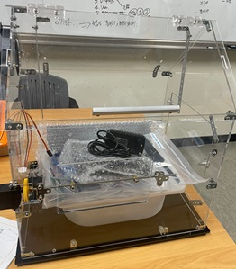
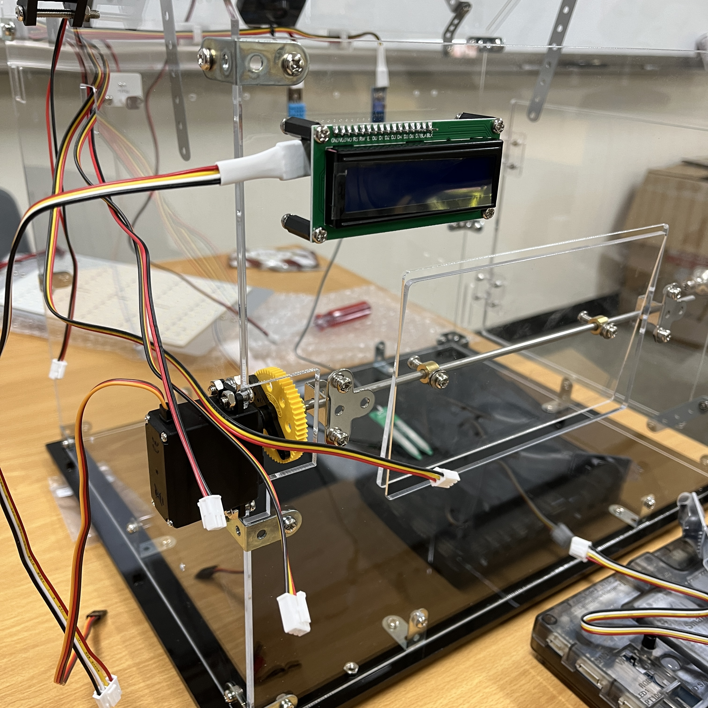

# [SSR Smart Farm]

## 홍민이 : **"우린 미래를 경작한다."**

- 고려대학교 HRD IoT 개발자과정 파이널 프로젝트입니다.
- [slide(보기 전용)](https://www.canva.com/design/DAGIo3UenlM/_KW2WdmP_S_bjc8OKEcd7A/view?utm_content=DAGIo3UenlM&utm_campaign=designshare&utm_medium=link&utm_source=editor)
- [slide(계획 발표)](https://docs.google.com/presentation/d/1gJG-Qnbx-0N8gWtX3mH1qRT7-PApX_3W-6SjmxGCNGo/edit#slide=id.p)
- [여기를 클릭하세요](https://google.com)
-------------------------------
 

## 👋 **Introduction**
 
<table>
    <tr>
        <th>프로젝트 명 </th>
        <th>가정용 스마트 팜</th>
        <th>개발기간</th>
        <th>24.06.20. - 24.07.09.</th>
    </tr>
    <tr>
        <th>프로젝트 성격</th>
        <th>Final project</th>
        <th>개발인원</th>
        <th>팀 / 3명 
          (<a href="https://github.com/hongsola92">홍솔아</a>｜
          <a href="https://github.com/gambitbro">민병근</a> |
          <a href="https://github.com/MrTwee">이진우</a>)
      </th>
    </tr>
      <tr>
        <th>프로젝트 개요</th>
        <th>가정용 스마트팜 만들기 </th>
        <th>개발환경&nbsp;</th>
        <th>Arduino IDE,  VScode,  Linux </th>
    </tr>
    <tr>
        <th>사용 센서</th>
        <th colspan="3">온 습도 센서, 토양습도 센서, 물 수위 센서, 조도 센서, PH 센서 </th>
    </tr>
    <tr>
        <th>사용 하드웨어</th>
        <th colspan="3">Arduino, RaspberryPI, Jetson Nano
        </th>
    </tr>    
    <tr>
        <th>개발언어</th>
        <th colspan="3">C/C++, Python</th>
    </tr>
    <tr>
        <th>사용기술</th>
        <th colspan="3">
              (데이터베이스) SQLite or Google CLoud Database
              (Web) Flask
              (온습도 측정) Adafruit_DHT
              (GPIO 제어) RPi.GPIO
              (물 수위 센서, 토양 수분 센서) spidev
             
             
        </th>
    </tr>
</table>
 
 
 

## 📑 **Role & Member**
 
<table>
    <tr>
        <th width="16%">업무 / 구성원</th>
        <th width="17%">홍솔아</th>
        <th width="17%">민병근</th>        
        <th width="14%">이진우</th>        
    </tr>
    <tr>
        <th>프로젝트 기획</th>
        <th colspan="3"> 
개요작성, 회의, 의견제안 
 </th>
    </tr>
    <tr>
        <th>요구분석</th>
        <th colspan="3"> 
 문서작성, 회의, 의견제안 
 </th>
    </tr>
        <th>소스(코딩)</th>
        <th>
             RaspberryPI에서 Cloud DB 구현, 데이터 저장 및 관리
             PPT, 계획서, 기술서 작성
             Data Wrangling
             스마트 팜 구조 조립 및 완성
        <th>
             Arduino senser 구현 및 데이터 수집
             Arduino와 RaspberryPI 블루투스 연결(or 시리얼 연결) 및 데이터 전송
             Data Wrangling
             PPT, 계획서, 기술서 작성
             스마트 팜 구조 조립 및 완성
        <th>
             식물 관찰을 위한 카메라 OpenCV 코드 작성
             PPT, 계획서, 기술서 작성
             Data Wrangling
             스마트 팜 구조 조립 및 완성
        </th>
    </tr>
</table>

----------------------
# 프로젝트 일정 🗓️
## 주요 일정 
    ● **개발 시작**: 2024-06-20 🕒
    ● **중간 점검**: 2024-07-01 📋
    ● **최종 완료**: 2024-07-09 ⏰
--------------------
# 일별 일정 🗓️
## 2024-06-20(목)
    ● 아이디어 회의 🤔
    ● 프로젝트 일정 작성
    ● 구글 슬라이드 제작
    ● project github 설정
    ● 역할 분담
    ● 재료 선정

## 2024-06-21(금)
    ● 아이디어 회의 🤔
    ● 프로젝트 일정 작성
    ● 구글 슬라이드 제작
    ● 역할 분담
    ● 재료 선정

## 2024-06-24(월)
    ● 아이디어 회의 🤔
        - 작물 변경 논의 ==> '상추' 하기로 결정.
        - 재배 방식 변경 논의 ==> '수경'-> '양액' 으로 변경.
        - 추가 기능 고려: chatGPT 기능 삽입 고려.(재배 하면서 궁금한 것이 있으면 바로 물어볼 수 있게)
        - db 변경 논의 ==> 클라우드DB + MySQL 같이 하기. 
    ● 품의서 작성 및 제출
    ● 재료 구매
    ● 가상환경에서 MySQL 데이터베이스 테스트

## 2024-06-25(화)
    ● 회의🤔
    ● google cloud_mysql table 생성.
    ● 추가 재료 확인 및 아이디어 나누기
    ● 아두이노 메가 <--> 라즈베리파이4 or 5 코드 임시작성
    ● 스마트팜 IoT 전체적 구조 파악 및 설계 방향 논의

## 2024-06-26(수)
    ● Arduino UNO와 RaspberryPi4 => 블루투스 연결하여 신호 왔다갔다 하는지 테스트.
    ● UNO보드의 모듈은 cc2541(data sheet 참고), RaspberryPi4에서 connect error, 연결되었다고 나오는 즉시 에러뜨며 끊김 -> 블루투스 연결 테스트 실패
        해결방안 -> 아두이노 메가 보드의 와이파이 모듈 사용이 어떨까(Cloud SQL과 직접 연동)
    ● 스마트팜 외형 1차 제작
- 

## 2024-06-27(목)
    ● 회의🤔
    
## 2024-06-28(금)
    ● 회의🤔
    ● 센서 조립(조도, 온습도, 토양수분, LED 등)
    ● 아두이노 메가보드에 각 모듈&센서 코드 업로드 및 테스트
    ● 전체적 구조 파악 및 변경점 고려
    ● 스마트 팜 지붕 부분 경첩 수리
    ● 작물 재 선정 및 재료 준비(다음 주 싹 틔우기 예정)
    ● IC 카메라 작동 원리 파악
- 

## 2024-07-01(월)
    ● 회의🤔
    ● 스위트 바질 파종, 빛 차단하여 보관(발아까지 약 2~3일 예정).
    ● 아두이노 메가 액츄에이터 작동 코드 및 센서 데이터 받아오는 코드 작성.
    ● 메가 보드의 와이파이 모듈(ESP8266)을 통해 Google Cloud DB에 센서 데이터를 저장하기 위한 php 코드 작성 및
        VM 인스턴스 생성하여 php 파일 업로드(SCP, FTP 등).
        permission denied(public key) 오류로 인해 VM 인스턴스의 /var/www/html 경로 안에 insert_data.php 파일 직접 작성하여 저장.
    ● 메가 보드에 코드 업로드하여 테스트했으나, WiFi.init() 단계에서 막힘. 와이파이 모듈 불러오기의 문제인듯 보임(모듈의 반응이 없음).

## 2024-07-02(화)
    ● 회의🤔
    ● 파종한 씨앗이 싹트기 시작.
    ● iptime_iot 와이파이를 아두이노 메가보드와 연결하기 성공. 하지만, 연결 이후에 데이터를 서버로 보내는 과정에서 오류가 생김.
    ● 
    ● 아두이노 -> VM인스턴스의 PHP(apache) -> GCD(SQL) 과정에서 PHP파일과 SQL은 정상적으로 연결되어 작동됨을 확인.
        (http://35.232.26.6/insert_data.php) 정상적으로 쿼리가 보내짐을 확인함.
        각 데이터에 NULL값을 허용해놨기 때문에, 아두이노로부터 데이터를 받지 못한 상태로 타임스탬프만 찍혀서 SQL저장됨.
    ● SQL 관련 참고: https://bedecked-decision-12c.notion.site/MySQLDB-6c9911989fac446b9f161dc78e224078

----------------------------
- 📚 스마트팜 외부(사진)

- 📚 스마트팜 내부(사진)
